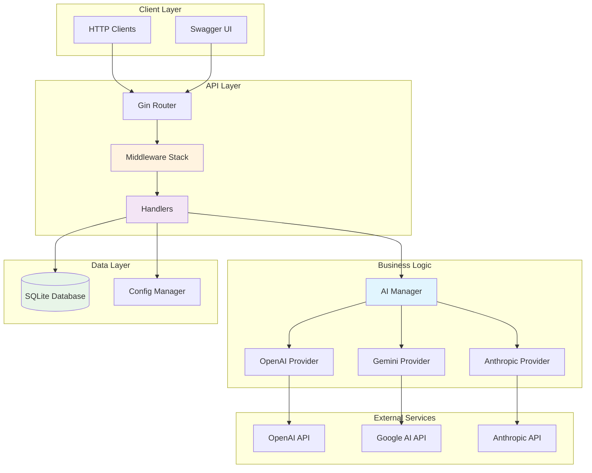
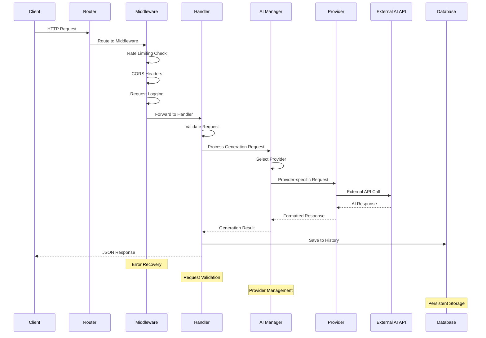
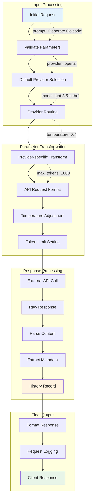

# AI Service - Multi-Provider AI Content Generation

A comprehensive Go-based AI service that provides unified access to multiple AI providers (OpenAI, Google Gemini, Anthropic Claude) with advanced features including provider comparison, request tracking, and detailed analytics.

## 🚀 Features

- **Multi-Provider Support**: Seamlessly integrate with OpenAI GPT, Google Gemini, and Anthropic Claude
- **Provider Comparison**: Compare responses across multiple AI providers simultaneously
- **Request History**: Track and analyze all AI generation requests
- **Rate Limiting**: Built-in rate limiting to prevent abuse
- **Swagger Documentation**: Auto-generated API documentation
- **Health Monitoring**: Comprehensive health checks and metrics
- **Database Integration**: SQLite database for persistent storage
- **Configurable**: Environment-based configuration management

## 🏗️ Architecture Overview

### Service Component Structure



### Request Flow Control



### Data Lineage - Request Parameter Flow



## 🔧 Installation & Setup

### Prerequisites

- Go 1.21 or higher
- Git

### Quick Start

1. **Clone the repository**
```bash
git clone <repository-url>
cd ai-service
```

2. **Install dependencies**
```bash
go mod download
```

3. **Configure environment variables**
```bash
cp .env.example .env
# Edit .env with your API keys
```

4. **Run the service**
```bash
go run main.go
```

The service will start on `http://localhost:8080` with Swagger documentation available at `http://localhost:8080/swagger/index.html`

### Configuration

Create a `.env` file with the following variables:

```env
# Service Configuration
PORT=8080
GIN_MODE=debug

# AI Provider API Keys
OPENAI_API_KEY=your_openai_api_key_here
GEMINI_API_KEY=your_gemini_api_key_here
ANTHROPIC_API_KEY=your_anthropic_api_key_here

# Database
DB_PATH=./ai_service.db

# Rate Limiting
RATE_LIMIT_REQUESTS_PER_MINUTE=60

# Default Provider
DEFAULT_AI_PROVIDER=openai
```

## 📚 API Documentation

### Core Endpoints

| Method | Endpoint | Description |
|--------|----------|-------------|
| `POST` | `/api/v1/generate` | Generate content using specified AI provider |
| `POST` | `/api/v1/compare` | Compare responses across multiple providers |
| `GET` | `/api/v1/providers` | Get detailed provider comparison |
| `GET` | `/api/v1/commands` | Get AI command examples and best practices |
| `GET` | `/api/v1/history` | Retrieve generation history |
| `GET` | `/api/v1/stats` | Get usage statistics |
| `GET` | `/api/v1/health` | Health check endpoint |

### Usage Examples

#### 1. Basic Content Generation

```bash
curl -X POST http://localhost:8080/api/v1/generate \
  -H "Content-Type: application/json" \
  -d '{
    "provider": "openai",
    "model": "gpt-3.5-turbo",
    "prompt": "Write a hello world program in Go",
    "system_message": "You are an expert Go developer",
    "max_tokens": 1000,
    "temperature": 0.7
  }'
```

#### 2. Provider Comparison

```bash
curl -X POST http://localhost:8080/api/v1/compare \
  -H "Content-Type: application/json" \
  -d '{
    "prompt": "Explain quantum computing in simple terms",
    "providers": ["openai", "gemini"],
    "max_tokens": 500,
    "temperature": 0.5
  }'
```

#### 3. Get Provider Information

```bash
curl http://localhost:8080/api/v1/providers
```

## 🤖 AI Provider Comparison

### OpenAI GPT

**Strengths:**
- ✅ Excellent general knowledge and reasoning
- ✅ Strong code generation capabilities
- ✅ Wide range of available models
- ✅ Reliable and mature API
- ✅ Extensive documentation and community support

**Weaknesses:**
- ❌ Can be expensive for high-volume usage
- ❌ Knowledge cutoff limitations
- ❌ Rate limiting on free tier

**Best For:**
- General text generation
- Code completion and debugging
- Creative writing tasks
- Question answering systems

**Pricing:** ~$0.002/1K tokens for GPT-3.5, ~$0.03/1K tokens for GPT-4

### Google Gemini

**Strengths:**
- ✅ Multimodal capabilities (text, images, code)
- ✅ Large context window (up to 1M tokens)
- ✅ Good reasoning and analysis capabilities
- ✅ Free tier available
- ✅ Fast response times

**Weaknesses:**
- ❌ Newer platform with less ecosystem maturity
- ❌ Limited third-party integrations
- ❌ Smaller community compared to OpenAI

**Best For:**
- Multimodal tasks involving text and images
- Long document analysis
- Research and analytical tasks
- Cost-effective AI solutions

**Pricing:** Free tier with generous limits, pay-per-use for pro features

### Anthropic Claude

**Strengths:**
- ✅ Strong focus on AI safety and alignment
- ✅ Excellent analytical and reasoning capabilities
- ✅ Thoughtful and nuanced responses
- ✅ Good refusal mechanisms for harmful content

**Weaknesses:**
- ❌ More conservative in responses
- ❌ Limited availability in some regions
- ❌ Higher cost compared to alternatives

**Best For:**
- Safety-critical applications
- Research and academic use
- Ethical AI implementations
- Complex analysis tasks

**Pricing:** Premium pricing model, typically higher than OpenAI

### Comparison Matrix

| Feature | OpenAI | Gemini | Anthropic |
|---------|--------|--------|-----------|
| **Code Generation** | ⭐⭐⭐⭐⭐ | ⭐⭐⭐⭐ | ⭐⭐⭐⭐ |
| **Creative Writing** | ⭐⭐⭐⭐⭐ | ⭐⭐⭐⭐ | ⭐⭐⭐⭐⭐ |
| **Data Analysis** | ⭐⭐⭐⭐ | ⭐⭐⭐⭐⭐ | ⭐⭐⭐⭐⭐ |
| **Cost Effectiveness** | ⭐⭐⭐ | ⭐⭐⭐⭐⭐ | ⭐⭐ |
| **API Reliability** | ⭐⭐⭐⭐⭐ | ⭐⭐⭐⭐ | ⭐⭐⭐⭐ |
| **Context Length** | ⭐⭐⭐ | ⭐⭐⭐⭐⭐ | ⭐⭐⭐⭐ |
| **Safety Features** | ⭐⭐⭐⭐ | ⭐⭐⭐⭐ | ⭐⭐⭐⭐⭐ |

## 🎯 AI Command Examples

### Code Generation Commands

```json
{
  "prompt": "Create a REST API endpoint in Go using Gin framework for user authentication with JWT tokens",
  "system_message": "You are an expert Go developer. Write secure, production-ready code with proper error handling.",
  "provider": "openai",
  "temperature": 0.2,
  "max_tokens": 1500
}
```

### Data Analysis Commands

```json
{
  "prompt": "Analyze this sales dataset and provide insights on trends, anomalies, and recommendations: [CSV data]",
  "system_message": "You are a senior data analyst. Provide actionable insights with statistical backing.",
  "provider": "gemini",
  "temperature": 0.3,
  "max_tokens": 2000
}
```

### Documentation Commands

```json
{
  "prompt": "Write comprehensive API documentation for these endpoints including examples and error codes",
  "system_message": "You are a technical writer. Create clear, comprehensive documentation for developers.",
  "provider": "anthropic",
  "temperature": 0.1,
  "max_tokens": 3000
}
```

### Optimization Commands

```json
{
  "prompt": "Optimize this SQL query for better performance and explain the improvements: [SQL query]",
  "system_message": "You are a database optimization expert. Focus on performance, readability, and best practices.",
  "provider": "openai",
  "temperature": 0.2,
  "max_tokens": 1000
}
```

## 📊 Best Practices

### Prompt Engineering

1. **Be Specific**: Provide clear, detailed requirements
2. **Set Context**: Use system messages to establish AI role and expertise
3. **Include Examples**: Provide sample inputs/outputs when possible
4. **Specify Format**: Clearly state desired output format (JSON, markdown, code, etc.)

### Temperature Guidelines

- **0.0 - 0.2**: Factual, deterministic responses (documentation, code)
- **0.3 - 0.5**: Balanced responses (analysis, explanations)
- **0.6 - 0.8**: Creative responses (writing, brainstorming)
- **0.9 - 1.0**: Highly creative responses (experimental, artistic)

### Provider Selection

- **Use OpenAI** for: General-purpose tasks, code generation, established workflows
- **Use Gemini** for: Cost-effective solutions, long-context tasks, multimodal needs
- **Use Anthropic** for: Safety-critical applications, nuanced analysis, ethical considerations

## 🔍 Monitoring & Analytics

### Available Metrics

- **Total Generations**: Count of all AI generation requests
- **Provider Usage**: Breakdown by AI provider
- **Average Response Time**: Performance metrics
- **Token Usage**: Cost analysis and optimization data
- **Error Rates**: Success/failure tracking

### Health Checks

The service provides comprehensive health checks at `/api/v1/health`:

```json
{
  "status": "healthy",
  "version": "1.0.0",
  "timestamp": "2024-01-15T10:30:00Z",
  "providers": {
    "openai": "available",
    "gemini": "available",
    "anthropic": "not_configured"
  }
}
```

## 🚀 Deployment

### Docker Deployment

```dockerfile
FROM golang:1.21-alpine AS builder
WORKDIR /app
COPY go.mod go.sum ./
RUN go mod download
COPY . .
RUN go build -o ai-service main.go

FROM alpine:latest
RUN apk --no-cache add ca-certificates
WORKDIR /root/
COPY --from=builder /app/ai-service .
COPY --from=builder /app/.env.example .env
EXPOSE 8080
CMD ["./ai-service"]
```

### Environment Variables for Production

```env
GIN_MODE=release
LOG_LEVEL=info
PORT=8080
RATE_LIMIT_REQUESTS_PER_MINUTE=100
```

## 🔐 Security Considerations

- **API Key Management**: Store API keys securely using environment variables
- **Rate Limiting**: Implement appropriate rate limits for your use case
- **Input Validation**: All inputs are validated before processing
- **Error Handling**: Sensitive information is not exposed in error messages
- **CORS Configuration**: Configure CORS policies for your domain

## 🤝 Contributing

1. Fork the repository
2. Create a feature branch
3. Make your changes
4. Add tests if applicable
5. Submit a pull request

## 📄 License

This project is licensed under the Apache 2.0 License - see the LICENSE file for details.

## 🆘 Support

For support and questions:
- Check the [Swagger documentation](http://localhost:8080/swagger/index.html)
- Review the API examples above
- Check the health endpoint for service status
- Monitor logs for debugging information

---

**Built with ❤️ using Go, Gin, and the power of multiple AI providers**
