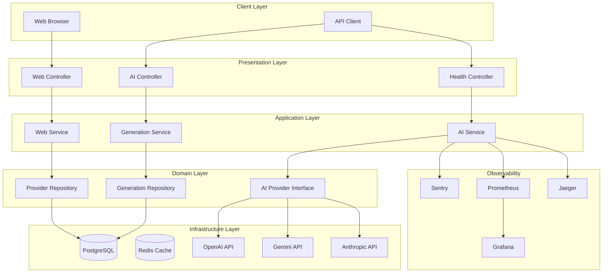
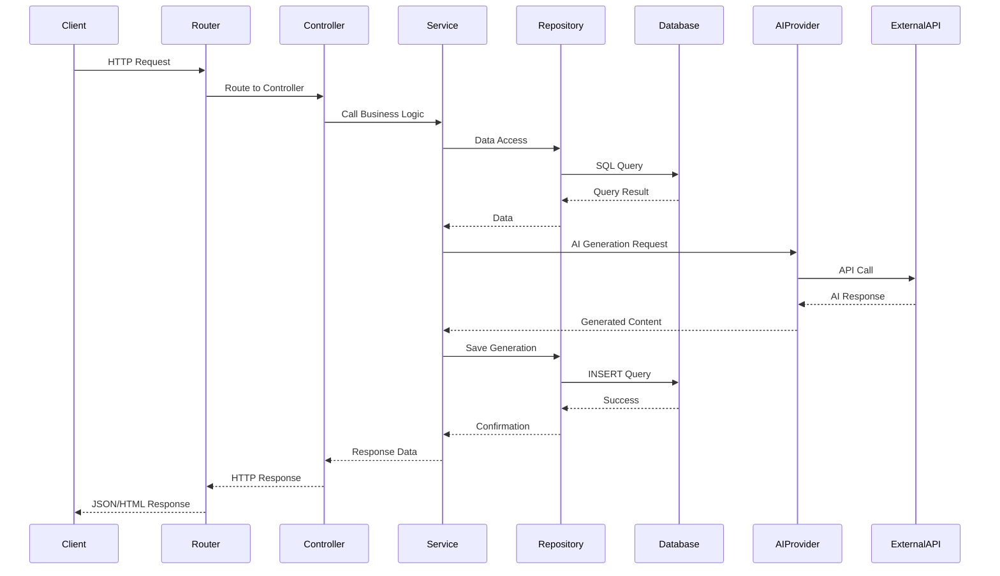
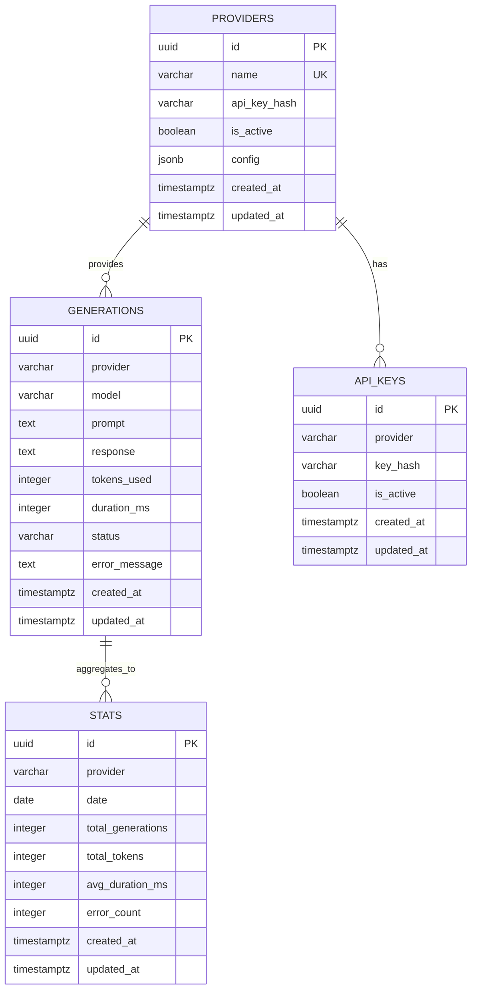
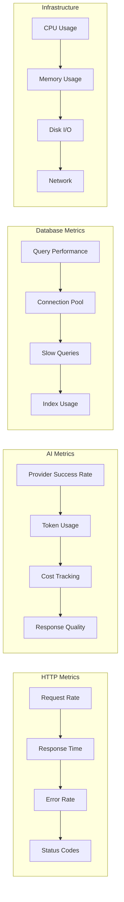

# 🤖 AI Service - Enterprise-Grade Go Application

A scalable, production-ready AI service built with Go, featuring multiple AI providers (OpenAI, Gemini, Anthropic), comprehensive monitoring, and clean architecture.

## 📋 Table of Contents

- [Features](#-features)
- [Architecture](#-architecture)
- [Quick Start](#-quick-start)
- [Database Setup](#-database-setup)
- [Testing](#-testing)
- [Monitoring & Observability](#-monitoring--observability)
- [API Documentation](#-api-documentation)
- [Development](#-development)
- [Deployment](#-deployment)

## ✨ Features

- **🤖 Multi-Provider AI Support**: OpenAI, Google Gemini, Anthropic Claude
- **🏗️ Clean Architecture**: Domain-driven design with clear separation of concerns
- **📊 Comprehensive Monitoring**: Sentry, OpenTelemetry, Prometheus + Grafana
- **🗄️ PostgreSQL Database**: SQLC for type-safe database operations
- **🧪 Full Test Coverage**: Unit, integration, and E2E tests
- **🔒 Security**: JWT authentication, API key management
- **📈 Performance**: Connection pooling, caching, rate limiting
- **🌐 Web UI**: Beautiful interface for AI interactions

## 🏗️ Architecture

### System Overview



### Request Flow



### Data Lineage

```mermaid
flowchart LR
    subgraph "Input Processing"
        A[User Prompt] --> B[Validation]
        B --> C[Provider Selection]
    end
    
    subgraph "AI Processing"
        C --> D[AI Provider Call]
        D --> E[Response Processing]
        E --> F[Token Calculation]
    end
    
    subgraph "Storage & Analytics"
        F --> G[Database Storage]
        G --> H[Statistics Update]
        H --> I[Metrics Collection]
    end
    
    subgraph "Output"
        I --> J[Response Formatting]
        J --> K[User Interface]
    end
    
    style A fill:#e1f5fe
    style K fill:#c8e6c9
    style G fill:#fff3e0
    style I fill:#f3e5f5
```



## 🚀 Quick Start

### Prerequisites

- Go 1.21 or higher
- PostgreSQL
- [sqlc](https://sqlc.dev/) - SQL compiler for Go

### Installing sqlc

The `sqlc` binary is not included in this repository due to its large size (52MB). You can download it from the official website:

```bash
# For macOS (Intel)
curl -L https://github.com/sqlc-dev/sqlc/releases/download/v1.25.0/sqlc_1.25.0_darwin_amd64.tar.gz | tar -xz sqlc

# For macOS (Apple Silicon)
curl -L https://github.com/sqlc-dev/sqlc/releases/download/v1.25.0/sqlc_1.25.0_darwin_arm64.tar.gz | tar -xz sqlc

# For Linux
curl -L https://github.com/sqlc-dev/sqlc/releases/download/v1.25.0/sqlc_1.25.0_linux_amd64.tar.gz | tar -xz sqlc

# Make it executable
chmod +x sqlc
```

Alternatively, you can install it via package managers:

```bash
# Using Homebrew (macOS)
brew install sqlc

# Using Go install
go install github.com/sqlc-dev/sqlc/cmd/sqlc@latest
```

### Environment Setup

1. **Clone the repository**

   ```bash
   git clone <repository-url>
   cd ai-service
   ```

2. **Set up environment variables**

   ```bash
   cp .env.example .env
   # Edit .env with your configuration
   ```

3. **Install dependencies**

   ```bash
   go mod tidy
   ```

4. **Set up database**

   ```bash
   # Using Docker Compose
   docker-compose up -d postgres
   
   # Or manually
   createdb ai_service
   psql -d ai_service -f scripts/migrations/001_initial_schema.sql
   psql -d ai_service -f scripts/migrations/002_add_performance_indexes.sql
   ```

5. **Run the application**

   ```bash
   go run cmd/main/main.go
   ```

The service will be available at:

- **Web UI**: <http://localhost:8080>
- **API**: <http://localhost:8080/api>
- **Health Check**: <http://localhost:8080/api/health>

## 🗄️ Database Setup

### PostgreSQL Configuration

```bash
# Environment variables
DB_HOST=localhost
DB_PORT=5432
DB_USER=postgres
DB_PASSWORD=
DB_NAME=ai_service
DB_SSLMODE=disable
DB_MAX_OPEN=25
DB_MAX_IDLE=5
DB_MAX_LIFETIME=5m
```

### Migration Management

```bash
# Apply migrations
psql -d ai_service -f scripts/migrations/001_initial_schema.sql
psql -d ai_service -f scripts/migrations/002_add_performance_indexes.sql

# Using SQLC (when available)
sqlc generate
```

### Database Schema



## 🧪 Testing

### Test Structure

```
tests/
├── unit/           # Unit tests for individual components
├── integration/    # Integration tests for database and APIs
├── e2e/           # End-to-end tests for complete workflows
└── utils/         # Test utilities and helpers
```

### Running Tests

```bash
# Run all tests
go test ./...

# Run specific test categories
go test ./tests/unit/...
go test ./tests/integration/...
go test ./tests/e2e/...

# Run with coverage
go test -cover ./...

# Run with verbose output
go test -v ./...
```

### Test Database Setup

```bash
# Create test database
createdb ai_service_test

# Set test environment variables
export TEST_DB_HOST=localhost
export TEST_DB_PORT=5432
export TEST_DB_USER=postgres
export TEST_DB_PASSWORD=password
export TEST_DB_NAME=ai_service_test
```

## 📊 Monitoring & Observability

### Sentry Integration

Sentry is integrated for error tracking and performance monitoring:

```go
// Error tracking
logger.Error(ctx, "Something went wrong")

// Performance monitoring
logger.StartTransactionWithFuncName(w, r)
```

### OpenTelemetry Setup

```bash
# Install OpenTelemetry collector
docker run -d --name otel-collector \
  -p 4317:4317 \
  -p 4318:4318 \
  -p 55679:55679 \
  otel/opentelemetry-collector:latest
```

### Prometheus & Grafana

#### Prometheus Configuration

```yaml
# prometheus.yml
global:
  scrape_interval: 15s

scrape_configs:
  - job_name: 'ai-service'
    static_configs:
      - targets: ['localhost:8080']
    metrics_path: '/metrics'
```

#### Grafana Dashboards

**System Overview Dashboard**

- Request rate and response times
- Error rates by endpoint
- Database connection pool status
- Memory and CPU usage

**AI Service Dashboard**

- Provider performance comparison
- Token usage and costs
- Generation success/failure rates
- Response time percentiles

**Database Performance Dashboard**

- Query execution times
- Connection pool utilization
- Slow query analysis
- Index usage statistics

### Key Metrics



## 📚 API Documentation

### Authentication

```bash
# Get JWT token
curl -X POST http://localhost:8080/api/auth/login \
  -H "Content-Type: application/json" \
  -d '{"username": "user", "password": "password"}'
```

### AI Generation

```bash
# Generate content
curl -X POST http://localhost:8080/api/generate \
  -H "Content-Type: application/json" \
  -H "Authorization: Bearer <token>" \
  -d '{
    "provider": "openai",
    "model": "gpt-3.5-turbo",
    "prompt": "Write a hello world program in Go",
    "max_tokens": 1000,
    "temperature": 0.7
  }'
```

### Provider Comparison

```bash
# Compare multiple providers
curl -X POST http://localhost:8080/api/compare \
  -H "Content-Type: application/json" \
  -H "Authorization: Bearer <token>" \
  -d '{
    "prompt": "Explain quantum computing",
    "providers": ["openai", "gemini"],
    "max_tokens": 500
  }'
```

### Statistics

```bash
# Get generation statistics
curl -X GET "http://localhost:8080/api/stats?start_date=2024-01-01&end_date=2024-01-31" \
  -H "Authorization: Bearer <token>"
```

## 🛠️ Development

### Project Structure

```
ai-service/
├── cmd/
│   ├── main/           # Application entry point
│   └── config/         # Configuration management
├── internal/
│   ├── app/            # Application setup
│   │   ├── database/   # Database connection
│   │   └── middleware/ # HTTP middleware
│   ├── controller/     # HTTP controllers
│   ├── entity/         # Domain entities
│   ├── model/          # Data models
│   ├── outbound/       # External service integrations
│   ├── repository/     # Data access layer
│   ├── routes/         # HTTP routing
│   ├── service/        # Business logic
│   ├── state/          # Application state
│   └── util/           # Utilities
│       ├── authentication/ # JWT authentication
│       ├── exception/      # Error handling
│       ├── httphelper/     # HTTP utilities
│       ├── json/           # JSON utilities
│       ├── logger/         # Logging with Sentry
│       ├── template/       # HTML templates
│       └── validator/      # Input validation
├── scripts/
│   └── migrations/     # Database migrations
├── tests/              # Test suites
└── docs/               # Documentation
```

### Code Generation

```bash
# Generate SQLC code
sqlc generate

# Generate mocks
mockgen -source=internal/repository/generation_repository.go -destination=tests/mocks/generation_repository_mock.go
```

### Linting and Formatting

```bash
# Format code
go fmt ./...

# Run linter
golangci-lint run

# Run security scanner
gosec ./...
```

## 🚀 Deployment

### Docker Deployment

```bash
# Build image
docker build -t ai-service .

# Run container
docker run -d \
  --name ai-service \
  -p 8080:8080 \
  --env-file .env \
  ai-service
```

### Docker Compose

```yaml
# docker-compose.yml
version: '3.8'
services:
  ai-service:
    build: .
    ports:
      - "8080:8080"
    environment:
      - DB_HOST=postgres
      - REDIS_HOST=redis
    depends_on:
      - postgres
      - redis
  
  postgres:
    image: postgres:14
    environment:
      POSTGRES_DB: ai_service
      POSTGRES_USER: postgres
      POSTGRES_PASSWORD: password
    volumes:
      - postgres_data:/var/lib/postgresql/data
  
  redis:
    image: redis:7-alpine
    volumes:
      - redis_data:/data
  
  prometheus:
    image: prom/prometheus
    ports:
      - "9090:9090"
    volumes:
      - ./prometheus.yml:/etc/prometheus/prometheus.yml
  
  grafana:
    image: grafana/grafana
    ports:
      - "3000:3000"
    environment:
      - GF_SECURITY_ADMIN_PASSWORD=admin
    volumes:
      - grafana_data:/var/lib/grafana

volumes:
  postgres_data:
  redis_data:
  grafana_data:
```

### Kubernetes Deployment

```yaml
# k8s/deployment.yaml
apiVersion: apps/v1
kind: Deployment
metadata:
  name: ai-service
spec:
  replicas: 3
  selector:
    matchLabels:
      app: ai-service
  template:
    metadata:
      labels:
        app: ai-service
    spec:
      containers:
      - name: ai-service
        image: ai-service:latest
        ports:
        - containerPort: 8080
        env:
        - name: DB_HOST
          valueFrom:
            secretKeyRef:
              name: ai-service-secrets
              key: db-host
        resources:
          requests:
            memory: "256Mi"
            cpu: "250m"
          limits:
            memory: "512Mi"
            cpu: "500m"
```

## 🤝 Contributing

1. Fork the repository
2. Create a feature branch (`git checkout -b feature/amazing-feature`)
3. Commit your changes (`git commit -m 'Add amazing feature'`)
4. Push to the branch (`git push origin feature/amazing-feature`)
5. Open a Pull Request

### Development Guidelines

- Follow Go best practices and conventions
- Write comprehensive tests for new features
- Update documentation for API changes
- Ensure all tests pass before submitting PR
- Use conventional commit messages

## 📄 License

This project is licensed under the MIT License - see the [LICENSE](LICENSE) file for details.

## 🆘 Support

- **Documentation**: [Wiki](link-to-wiki)
- **Issues**: [GitHub Issues](link-to-issues)
- **Discussions**: [GitHub Discussions](link-to-discussions)
- **Email**: <support@ai-service.com>

---

**Built with ❤️ using Go, PostgreSQL, and modern observability tools**
