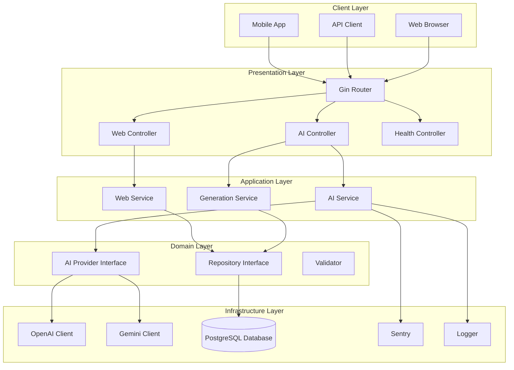
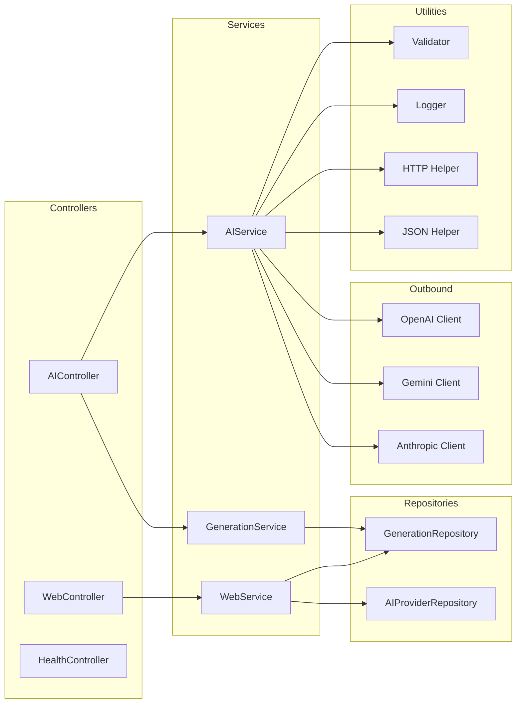
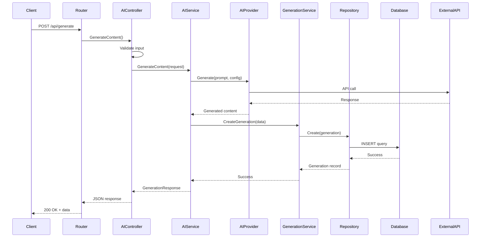
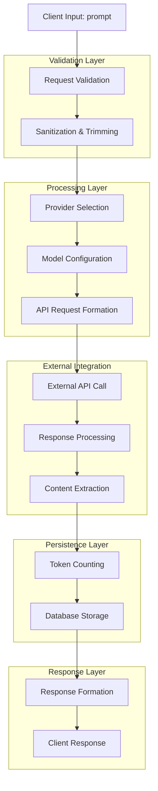
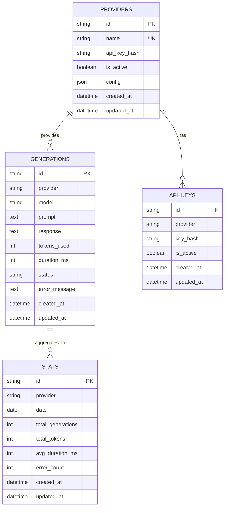
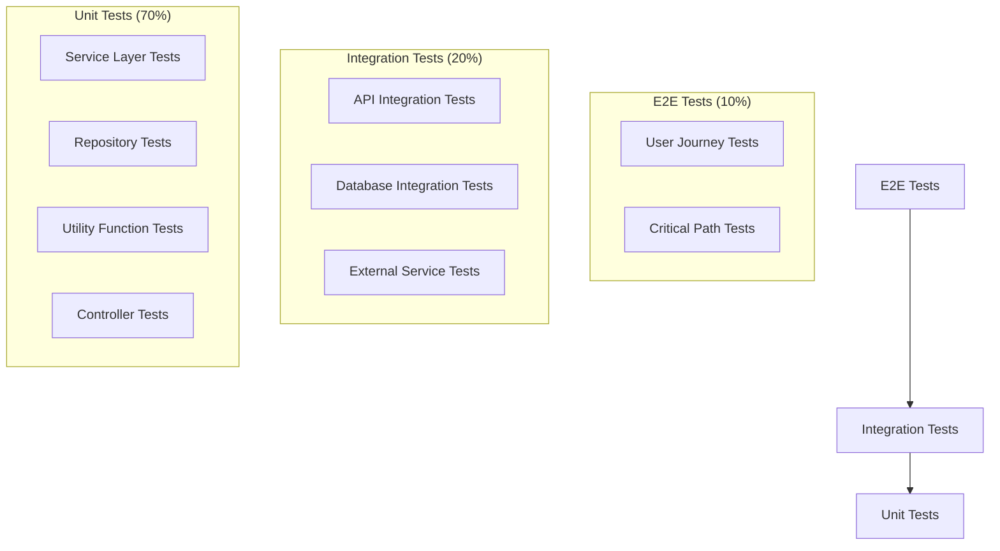

# AI Service - Technical Design Document

## Table of Contents

1. [Overview](#overview)
2. [Architecture](#architecture)
3. [System Components](#system-components)
4. [Data Flow](#data-flow)
5. [Database Design](#database-design)
6. [API Design](#api-design)
7. [Security](#security)
8. [Configuration](#configuration)
9. [Deployment](#deployment)
10. [Development Workflow](#development-workflow)
11. [Testing Strategy](#testing-strategy)
12. [Monitoring & Observability](#monitoring--observability)

## Overview

The AI Service is a Go-based microservice built with the Gin framework, designed to provide AI content generation capabilities through multiple providers (OpenAI, Gemini, Anthropic). The service follows clean architecture principles with clear separation of concerns and comprehensive testing.

### Key Features

- **Multi-Provider AI Integration**: Support for OpenAI, Gemini, and Anthropic APIs
- **Content Generation**: AI-powered text generation with customizable parameters
- **Provider Comparison**: Side-by-side comparison of different AI providers
- **History Tracking**: Complete audit trail of all generations
- **Statistics & Analytics**: Performance metrics and usage statistics
- **Web UI**: User-friendly interface for interaction
- **RESTful API**: Comprehensive API for programmatic access
- **Real-time Monitoring**: Sentry integration for error tracking

## Architecture

### High-Level Architecture



### Component Architecture



## System Components

### 1. Controllers Layer

**Purpose**: Handle HTTP requests and responses, input validation, and routing.

#### AIController
- **Responsibilities**: AI generation endpoints, provider management, history retrieval
- **Endpoints**:
  - `POST /api/generate` - Generate content with specified provider
  - `POST /api/compare` - Compare multiple providers
  - `GET /api/providers` - List available providers
  - `GET /api/history` - Retrieve generation history
  - `GET /api/stats` - Get usage statistics

#### WebController
- **Responsibilities**: Web UI endpoints, template rendering
- **Endpoints**:
  - `GET /` - Home page
  - `GET /history` - History page
  - `GET /stats` - Statistics page
  - `GET /error` - Error page

#### HealthController
- **Responsibilities**: Health checks, system status
- **Endpoints**:
  - `GET /api/health` - Health check

### 2. Services Layer

**Purpose**: Business logic implementation, orchestration of domain operations.

#### AIService
- **Responsibilities**: AI provider management, content generation orchestration
- **Key Methods**:
  - `GenerateContent()` - Generate content using specified provider
  - `CompareProviders()` - Compare multiple providers
  - `GetProviders()` - Retrieve available providers

#### GenerationService
- **Responsibilities**: Generation history management, statistics calculation
- **Key Methods**:
  - `CreateGeneration()` - Save generation record
  - `GetHistory()` - Retrieve generation history
  - `GetStats()` - Calculate usage statistics

#### WebService
- **Responsibilities**: Web UI data preparation, template data aggregation
- **Key Methods**:
  - `GetHomeData()` - Prepare home page data
  - `GetHistoryData()` - Prepare history page data
  - `GetStatsData()` - Prepare statistics page data

### 3. Repository Layer

**Purpose**: Data access abstraction, database operations.

#### GenerationRepository
- **Responsibilities**: Generation history CRUD operations
- **Key Methods**:
  - `Create()` - Save new generation
  - `GetByID()` - Retrieve by ID
  - `GetByProvider()` - Retrieve by provider
  - `GetRecent()` - Get recent generations
  - `GetStats()` - Get statistics

#### AIProviderRepository
- **Responsibilities**: AI provider configuration management
- **Key Methods**:
  - `GetProviders()` - Get available providers
  - `UpdateProvider()` - Update provider configuration

### 4. Outbound Layer

**Purpose**: External service integration, API client management.

#### OpenAI Client
- **Responsibilities**: OpenAI API integration
- **Features**: GPT model support, token management, error handling

#### Gemini Client
- **Responsibilities**: Google Gemini API integration
- **Features**: Gemini model support, streaming responses

#### Anthropic Client
- **Responsibilities**: Anthropic Claude API integration
- **Features**: Claude model support, conversation management

## Data Flow

### Request Flow: Content Generation



### Data Lineage: Prompt Processing



## Database Design

### Schema Overview



### Table Details

#### Generations Table
```sql
CREATE TABLE generations (
    id TEXT PRIMARY KEY,
    provider TEXT NOT NULL,
    model TEXT NOT NULL,
    prompt TEXT NOT NULL,
    response TEXT NOT NULL,
    tokens_used INTEGER NOT NULL DEFAULT 0,
    duration_ms INTEGER NOT NULL DEFAULT 0,
    status TEXT NOT NULL DEFAULT 'success',
    error_message TEXT,
    created_at DATETIME DEFAULT CURRENT_TIMESTAMP,
    updated_at DATETIME DEFAULT CURRENT_TIMESTAMP
);
```

#### Providers Table
```sql
CREATE TABLE providers (
    id TEXT PRIMARY KEY,
    name TEXT UNIQUE NOT NULL,
    api_key_hash TEXT,
    is_active BOOLEAN DEFAULT 1,
    config TEXT,
    created_at DATETIME DEFAULT CURRENT_TIMESTAMP,
    updated_at DATETIME DEFAULT CURRENT_TIMESTAMP
);
```

#### Stats Table
```sql
CREATE TABLE stats (
    id TEXT PRIMARY KEY,
    provider TEXT NOT NULL,
    date DATE NOT NULL,
    total_generations INTEGER DEFAULT 0,
    total_tokens INTEGER DEFAULT 0,
    avg_duration_ms INTEGER DEFAULT 0,
    error_count INTEGER DEFAULT 0,
    created_at DATETIME DEFAULT CURRENT_TIMESTAMP,
    updated_at DATETIME DEFAULT CURRENT_TIMESTAMP,
    UNIQUE(provider, date)
);
```

## API Design

### RESTful Endpoints

#### AI Generation Endpoints

```yaml
POST /api/generate:
  description: Generate content using specified AI provider
  request:
    body:
      application/json:
        schema:
          type: object
          properties:
            provider:
              type: string
              enum: [openai, gemini, anthropic]
            model:
              type: string
              example: "gpt-3.5-turbo"
            prompt:
              type: string
              example: "Write a hello world program in Go"
            max_tokens:
              type: integer
              example: 1000
            temperature:
              type: number
              format: float
              example: 0.7
            system_message:
              type: string
              example: "You are a helpful coding assistant"
  response:
    200:
      description: Successful generation
      body:
        application/json:
          schema:
            type: object
            properties:
              id:
                type: string
              provider:
                type: string
              model:
                type: string
              content:
                type: string
              tokens_used:
                type: integer
              generated_at:
                type: string
                format: date-time
              duration:
                type: string
```

#### Provider Comparison Endpoint

```yaml
POST /api/compare:
  description: Compare multiple AI providers
  request:
    body:
      application/json:
        schema:
          type: object
          properties:
            prompt:
              type: string
              required: true
            providers:
              type: array
              items:
                type: string
                enum: [openai, gemini, anthropic]
            max_tokens:
              type: integer
            temperature:
              type: number
              format: float
```

#### History and Statistics Endpoints

```yaml
GET /api/history:
  description: Retrieve generation history
  parameters:
    - name: provider
      in: query
      type: string
    - name: limit
      in: query
      type: integer
      default: 10
    - name: offset
      in: query
      type: integer
      default: 0

GET /api/stats:
  description: Get usage statistics
  parameters:
    - name: start_date
      in: query
      type: string
      format: date
    - name: end_date
      in: query
      type: string
      format: date
    - name: provider
      in: query
      type: string
```

### Error Handling

```yaml
Error Responses:
  400:
    description: Bad Request
    body:
      application/json:
        schema:
          type: object
          properties:
            error:
              type: string
            code:
              type: integer
            message:
              type: string
  
  401:
    description: Unauthorized
  403:
    description: Forbidden
  404:
    description: Not Found
  500:
    description: Internal Server Error
```

## Security

### Security Measures

1. **Input Validation**
   - Request parameter validation using Go validator
   - SQL injection prevention through parameterized queries
   - XSS protection through proper output encoding

2. **Authentication & Authorization**
   - JWT-based authentication (optional)
   - API key management for AI providers
   - Role-based access control

3. **Data Protection**
   - API keys hashed in database
   - Sensitive data encryption
   - Secure communication with external APIs

4. **Error Handling**
   - No sensitive information in error messages
   - Proper logging without exposing secrets
   - Graceful error handling

### Security Configuration

```yaml
Security Headers:
  X-Content-Type-Options: nosniff
  X-Frame-Options: DENY
  X-XSS-Protection: 1; mode=block
  Content-Security-Policy: default-src 'self'
  Strict-Transport-Security: max-age=31536000; includeSubDomains

CORS Configuration:
  Allowed Origins: ["http://localhost:3000", "https://yourdomain.com"]
  Allowed Methods: ["GET", "POST", "PUT", "DELETE", "OPTIONS"]
  Allowed Headers: ["Content-Type", "Authorization"]
```

## Configuration

### Environment Variables

```bash
# Server Configuration
PORT=8080
ENV=development

# Database Configuration
DB_HOST=localhost
DB_PORT=5432
DB_USER=postgres
DB_PASSWORD=password
DB_NAME=ai_service
DB_SSLMODE=disable

# AI Provider API Keys
OPENAI_API_KEY=your_openai_api_key
GEMINI_API_KEY=your_gemini_api_key
ANTHROPIC_API_KEY=your_anthropic_api_key

# Security
JWT_SECRET=your_jwt_secret_key

# Monitoring
SENTRY_DSN=your_sentry_dsn

# Feature Flags
ENABLE_PPROF=false
ENABLE_SWAGGER=true
```

### Configuration Management

```go
type Config struct {
    Server   ServerConfig
    Database DatabaseConfig
    AI       AIConfig
    Security SecurityConfig
    Monitoring MonitoringConfig
}

type ServerConfig struct {
    Port string
    Env  string
}

type DatabaseConfig struct {
    Host     string
    Port     string
    User     string
    Password string
    DBName   string
    SSLMode  string
}

type AIConfig struct {
    OpenAIAPIKey   string
    GeminiAPIKey   string
    AnthropicAPIKey string
}
```

## Deployment

### Docker Deployment

```dockerfile
# Multi-stage build for production
FROM golang:1.23-alpine AS builder

WORKDIR /app
COPY go.mod go.sum ./
RUN go mod download

COPY . .
RUN CGO_ENABLED=1 GOOS=linux go build -a -installsuffix cgo -o ai-service cmd/main/main.go

FROM alpine:latest
RUN apk --no-cache add ca-certificates
WORKDIR /root/

COPY --from=builder /app/ai-service .
COPY --from=builder /app/scripts ./scripts

EXPOSE 8080
CMD ["./ai-service"]
```

### Docker Compose

```yaml
version: '3.8'

services:
  ai-service:
    build: .
    ports:
      - "8080:8080"
    environment:
      - PORT=8080
      - ENV=production
      - DB_HOST=postgres
      - DB_PORT=5432
      - DB_USER=postgres
      - DB_PASSWORD=password
      - DB_NAME=ai_service
    depends_on:
      - postgres
    volumes:
      - ./logs:/app/logs

  postgres:
    image: postgres:15-alpine
    environment:
      - POSTGRES_DB=ai_service
      - POSTGRES_USER=postgres
      - POSTGRES_PASSWORD=password
    volumes:
      - postgres_data:/var/lib/postgresql/data
    ports:
      - "5432:5432"

volumes:
  postgres_data:
```

### Kubernetes Deployment

```yaml
apiVersion: apps/v1
kind: Deployment
metadata:
  name: ai-service
spec:
  replicas: 3
  selector:
    matchLabels:
      app: ai-service
  template:
    metadata:
      labels:
        app: ai-service
    spec:
      containers:
      - name: ai-service
        image: ai-service:latest
        ports:
        - containerPort: 8080
        env:
        - name: PORT
          value: "8080"
        - name: ENV
          value: "production"
        resources:
          requests:
            memory: "256Mi"
            cpu: "250m"
          limits:
            memory: "512Mi"
            cpu: "500m"
        livenessProbe:
          httpGet:
            path: /api/health
            port: 8080
          initialDelaySeconds: 30
          periodSeconds: 10
        readinessProbe:
          httpGet:
            path: /api/health
            port: 8080
          initialDelaySeconds: 5
          periodSeconds: 5
```

## Development Workflow

### Prerequisites

1. **Go 1.23+**
2. **Git**
3. **Docker & Docker Compose**
4. **Make** (for build automation)

### Initial Setup

```bash
# 1. Clone the repository
git clone <repository-url>
cd go-gin-lambda

# 2. Run initial setup
make setup

# 3. Configure environment
make env
# Edit .env file with your API keys

# 4. Start development server
make run-dev
```

### Development Commands

```bash
# Quality checks
make check-all          # Run all quality checks
make check-quick        # Run quick checks
make fmt               # Format code
make lint              # Run linting
make vet               # Run go vet
make staticcheck       # Run staticcheck

# Testing
make test              # Run all tests
make test-unit         # Run unit tests only
make test-coverage     # Run tests with coverage
make test-benchmark    # Run benchmark tests

# Building
make build             # Build for current platform
make build-linux       # Build for Linux
make build-all         # Build for all platforms

# Running
make run               # Run locally
make run-dev           # Run with hot reload

# Docker
make docker-build      # Build Docker image
make docker-run        # Run Docker container
make docker-compose-up # Start with docker-compose

# Database
make db-reset          # Reset database
make db-migrate        # Run migrations

# Documentation
make swagger-gen       # Generate Swagger docs
make docs-gen          # Generate all docs

# Cleanup
make clean             # Clean build artifacts
make clean-all         # Clean everything
```

### Code Quality Standards

1. **Code Formatting**
   - Use `gofmt` for consistent formatting
   - Follow Go naming conventions
   - Use meaningful variable names

2. **Testing**
   - Unit tests for all business logic
   - Integration tests for external dependencies
   - E2E tests for critical user flows
   - Minimum 80% code coverage

3. **Documentation**
   - Comprehensive API documentation
   - Inline code comments for complex logic
   - README files for each package
   - Architecture decision records (ADRs)

4. **Security**
   - Regular security audits
   - Dependency vulnerability scanning
   - Input validation on all endpoints
   - Secure handling of sensitive data

## Testing Strategy

### Testing Pyramid



### Test Categories

#### Unit Tests
- **Purpose**: Test individual functions and methods
- **Scope**: Business logic, utilities, helpers
- **Tools**: Go testing package, testify
- **Location**: `tests/unit/`

#### Integration Tests
- **Purpose**: Test component interactions
- **Scope**: API endpoints, database operations
- **Tools**: Go testing package, testcontainers
- **Location**: `tests/integration/`

#### E2E Tests
- **Purpose**: Test complete user workflows
- **Scope**: Full application functionality
- **Tools**: Go testing package, HTTP client
- **Location**: `tests/e2e/`

### Test Data Management

```go
// Test utilities for consistent test data
func CreateTestGeneration(t *testing.T, db *sql.DB, provider, model, prompt, response string) string {
    // Implementation for creating test data
}

func CreateTestProvider(t *testing.T, db *sql.DB, name string, isActive bool) string {
    // Implementation for creating test providers
}
```

### Performance Testing

```bash
# Load testing with hey
hey -n 1000 -c 10 http://localhost:8080/api/health

# Benchmark testing
go test -bench=. -benchmem ./...

# Memory profiling
go test -memprofile=mem.prof ./...
go tool pprof mem.prof
```

## Monitoring & Observability

### Logging Strategy

```go
// Structured logging with different levels
logger.Info(ctx, "Request processed", "user_id", userID, "duration", duration)
logger.Error(ctx, "Database connection failed", "error", err)
logger.Debug(ctx, "Processing request", "request_id", requestID)
```

### Metrics Collection

```go
// Custom metrics
var (
    requestDuration = prometheus.NewHistogramVec(
        prometheus.HistogramOpts{
            Name: "http_request_duration_seconds",
            Help: "Duration of HTTP requests",
        },
        []string{"method", "endpoint", "status"},
    )
    
    generationCount = prometheus.NewCounterVec(
        prometheus.CounterOpts{
            Name: "ai_generation_total",
            Help: "Total number of AI generations",
        },
        []string{"provider", "model", "status"},
    )
)
```

### Health Checks

```go
// Health check endpoint
func (c *HealthController) GetHealthCheck(ctx *gin.Context) {
    health := &model.HealthResponse{
        Status:    "healthy",
        Version:   version,
        Timestamp: time.Now(),
        Providers: map[string]string{
            "openai":   "available",
            "gemini":   "available",
            "anthropic": "unavailable",
        },
    }
    
    ctx.JSON(http.StatusOK, health)
}
```

### Error Tracking

```go
// Sentry integration for error tracking
if err != nil {
    sentry.CaptureException(err)
    logger.Error(ctx, "Operation failed", "error", err)
    return err
}
```

### Monitoring Dashboard

```yaml
# Prometheus configuration
global:
  scrape_interval: 15s

scrape_configs:
  - job_name: 'ai-service'
    static_configs:
      - targets: ['localhost:8080']
    metrics_path: '/metrics'
```

## Conclusion

This technical design document provides a comprehensive overview of the AI Service architecture, implementation details, and operational considerations. The system is designed to be scalable, maintainable, and secure, with clear separation of concerns and comprehensive testing strategies.

### Key Strengths

1. **Clean Architecture**: Clear separation of concerns with well-defined layers
2. **Comprehensive Testing**: Multi-level testing strategy with high coverage
3. **Security Focus**: Multiple security measures and best practices
4. **Observability**: Comprehensive logging, metrics, and monitoring
5. **Scalability**: Designed for horizontal scaling and containerization
6. **Developer Experience**: Excellent tooling and automation

### Future Enhancements

1. **Caching Layer**: Redis integration for performance optimization
2. **Message Queue**: RabbitMQ/Kafka for async processing
3. **Rate Limiting**: Advanced rate limiting and throttling
4. **Multi-tenancy**: Support for multiple organizations
5. **Advanced Analytics**: Machine learning for usage patterns
6. **API Versioning**: Proper API versioning strategy

This design provides a solid foundation for building a robust, scalable AI service that can handle production workloads while maintaining high code quality and developer productivity. 